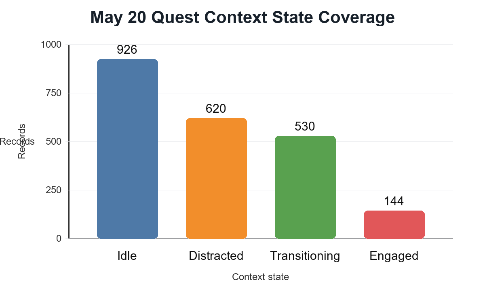

::: IEEEkeywords
extended reality, adaptive XR, context inference, gaze, pose, hand
tracking, multimodal interaction, Unity, Meta Quest
:::

# Introduction

XR training environments are increasingly expected to respond to user
attention, task flow, hesitation, and inactivity without requiring
explicit status input. A conventional XR task can detect object
collisions or button presses, but those events do not fully describe the
user's state. For example, a user may look away from the task, pause
before the next action, move between objects, or remain still without
completing an interaction. These states matter for adaptive guidance
because the appropriate support differs across focused work,
distraction, transition, and inactivity.

HarmonyXR GazePose-Context addresses this problem through a Unity-based
proof-of-concept for multimodal context inference. The prototype uses a
deliberately simple sorting task in which the user places a cube,
cylinder, and sphere into matching receptacles. The task is
intentionally constrained so the research focus remains on context
inference, signal fusion, and adaptive XR support rather than on game
complexity.

The project follows a phased WBS and implementation guide. Phase 1
captures gaze, head/body, hand, and spatial signals. Phase 2 converts
raw signals into features. Phase 2.3 fuses features into context states.
Phase 3 applies the inferred state inside the XR application layer.
Phase 4, the formal participant study, is not claimed as completed in
this paper.

The contributions are:

- a WBS-aligned Unity XR implementation for multimodal context
  inference;

- a three-layer architecture separating sensor abstraction, context
  inference, and XR app adaptation;

- an interpretable four-state context model for Engaged, Distracted,
  Transitioning, and Idle behavior;

- a headset-facing adaptive training shell that maps inferred context to
  guidance and support; and

- a Quest evidence package showing runtime launch, logging, signal
  coverage, and all four target context states across 2,220 valid
  context records.

# Related Work

## Gaze Tracking and Attention in VR

Eye tracking and gaze-based interaction are central to attention-aware
XR systems. Moreno-Arjonilla et al. survey VR eye-tracking hardware,
calibration, gaze estimation, datasets, and applications, showing that
gaze is a foundational signal for immersive attention analysis
[@moreno2024eyetracking]. Pastel et al. compare gaze accuracy and
precision in real and virtual environments and show that dynamic
conditions can make gaze interpretation more difficult
[@pastel2021gaze]. These findings support using gaze/AOI evidence in
HarmonyXR while avoiding a gaze-only interpretation of context.

## Multimodal Attention and XR Interaction

Multimodal sensing can reduce ambiguity that is present in any single
signal. Long et al. show that EEG and eye-tracking features can improve
classification of internal and external attention in VR
[@long2024multimodal]. Rakkolainen et al. review multimodal interaction
technologies across extended reality, including gaze, gesture, speech,
haptics, and physiological sensing [@rakkolainen2021technologies]. Kim
et al. describe the shift from controller-centered XR input toward hand,
gaze, wrist, voice, and multimodal input across device generations
[@kim2026controllers]. HarmonyXR follows this multimodal direction but
emphasizes a lightweight behavioral pipeline that can run inside a Unity
Quest prototype.

## Body, Head, and Hand Tracking

Body and posture signals provide complementary evidence for user state.
Bustamante et al. demonstrate skeleton-based posture recognition using
lightweight geometric heuristics [@bustamante2025skeleton], and
Neidhardt et al. show that XR body tracking can support movement
analysis in VR-based musculoskeletal training [@neidhardt2023body]. Hand
interaction is also important because pinch activity, object proximity,
and interaction frequency indicate whether the user is actively engaging
with task objects. Lei et al. present a sensor-fusion approach for
precise hand tracking in VR [@lei2023hand]. HarmonyXR does not attempt
to improve tracking accuracy itself; it uses available hand and pose
evidence as part of a higher-level context model.

## Context-Aware Adaptation

Gaze and context signals have been used to drive adaptive feedback and
interface behavior. Selaskowski et al. present gaze-based attention
refocusing training in VR for adults with ADHD [@selaskowski2023gaze].
Davari and Bowman propose a design space for context-aware XR interfaces
and adaptive content placement [@davari2024context]. Ramiotis and Mania
propose CONTEXT-GAD, a context-aware gaze adaptive dwell model for XR
selection [@ramiotis2025contextgad]. These works show the value of
context-aware XR, but many systems focus on interface placement or gaze
selection. HarmonyXR instead implements a general task-context
proof-of-concept that fuses gaze/AOI, pose, hand, spatial, and task
evidence into four interpretable runtime states.

# Research Problem

The research problem is: how can an XR training application infer
task-relevant user context from lightweight runtime signals and use that
inference to provide adaptive support without requiring explicit status
input from the user?

The implemented proof-of-concept addresses this question at systems
level. It asks whether the planned architecture can be built, executed
on a Quest headset, and validated through device-generated evidence. It
does not claim that adaptive support improves learning, workload, or
task performance because the planned Phase 4 user study has not yet been
completed.

The implemented scope includes Unity and Meta Quest execution, the
TrainingSimulation sorting task, four context states, runtime QA
metrics, context-state logging, adaptive guidance, and device-side
evidence collection. The excluded scope includes participant statistics,
NASA-TLX analysis, formal ground-truth annotation, and
baseline-versus-adaptive statistical comparison.

# System Overview

The implementation follows the three-layer architecture defined by the
project plan and implementation guide: Sensor Abstraction Layer, Context
Engine Layer, and XR Application Layer.
Fig. [1](#fig:pipeline){reference-type="ref" reference="fig:pipeline"}
summarizes the runtime pipeline.

<figure id="fig:pipeline" data-latex-placement="t">

<figcaption>HarmonyXR GazePose-Context runtime pipeline.</figcaption>
</figure>

## Sensor Abstraction Layer

The sensor abstraction layer corresponds to Phase 1 of the WBS. It
captures gaze/AOI evidence, head and body pose evidence, hand activity,
pinch state, object proximity, spatial context, and task-relevant scene
information. The layer writes these values into a shared runtime signal
frame so later stages do not depend directly on individual Unity
components.

## Context Engine Layer

The context engine combines Phase 2 feature extraction and Phase 2.3
context inference. Feature extractors convert raw signal values into
gaze, body, hand, and spatial features. The context engine then applies
interpretable fusion rules and a temporal state machine to infer a
stable context state and confidence value.

## XR Application Layer

The XR application layer corresponds to Phase 3. It consumes the
inferred context state and updates the headset-facing experience. This
layer includes onboarding, task guidance, adaptive prompts, idle
controls, completion messaging, QA output, and scene alignment behavior.

# Methodology

The methodology follows the implementation guide's pipeline: signal
acquisition, synchronization, feature extraction, multimodal fusion,
temporal stabilization, adaptive response, and validation. The pipeline
is rule-based rather than learned because the current project stage
prioritizes inspectability, reproducibility, and clear evidence mapping.

## WBS-Aligned Phase Structure

Phase 1 implements signal capture through scripts such as `GazeCapture`,
`BodyPoseCapture`, `HandCapture`, `SpatialContextDetector`, and
`SignalSynchroniser`. Phase 2 implements feature extraction through
gaze, body, hand, and body-hand feature extractors. Phase 2.3 implements
context inference using `ContextEngine`, `ContextFusionEngine`,
`ContextStateMachine`, and `ContextLogger`. Phase 3 implements the XR
application shell through `XRAppShellController`, `AdaptationManager`,
`TrainingSimulationUserGuide`, `TrainingSimulationTaskManager`, and
supporting task-object scripts.

## Signal Acquisition and Synchronization

The runtime collects signals from scene and headset-facing components
and synchronizes them into a common signal frame. The signal frame
includes gaze origin and direction, AOI hit information,
fixation-related timing, head pose, posture or spatial mode, hand pinch
state, interaction count, nearest object distance, context state,
confidence, previous state, hold duration, transition count, and nearest
interactable.

The implementation guide expects synchronized processing rather than
independent per-script interpretation. HarmonyXR follows this design by
using `SignalSynchroniser` as the bridge from raw capture scripts to
inference logic. This supports evidence review because context outputs
can be traced back to the signal values available in the same runtime
frame.

## Feature Extraction

Gaze features include task AOI focus, fixation-on-AOI, fixation
duration, dwell ratio, and saccade-like activity. Body and spatial
features include posture or boundary context, locomotion activity, and
movement values. Hand features include interaction frequency, pinch
activity, and object proximity. These features convert low-level signals
into inference-oriented evidence used by the context engine.

## Fusion and Stabilization

The context engine applies prioritized rule-based fusion. Engaged is
supported by task AOI focus, fixation or dwell evidence, active
interaction, and low head-gaze divergence. Distracted is supported by
lack of task AOI focus, low dwell, away evidence, and low interaction.
Transitioning captures movement between task states, task-adjacent gaze,
short fixation, changing proximity, or preparatory interaction. Idle
captures low body movement, low hand activity, no object proximity, and
little task-directed gaze.

The context state machine stabilizes outputs over time to reduce rapid
UI flicker. A state must persist before replacing the active state, and
the current state, confidence, previous state, and transition count are
preserved for logging and adaptation.

## Validation Method

Validation follows the implementation guide's QA gates rather than a
completed participant protocol. The completed validation checks include
Quest connection, APK installation, correct Unity activity launch, scene
visibility, context logging, state coverage, memory information,
graphics information, thermal information, and error-log review.
Evidence was collected through ADB commands and app-generated logs.

# Prototype Implementation

The prototype is implemented in Unity and currently targets Unity
6000.4.7f1. The verified Quest build uses OpenXR 1.16.1, Meta XR Core
SDK 201.0.0, XR Management 4.6.0, URP 17.4.0, Unity Input System 1.19.0,
TextMeshPro 5.0.0, Unity UI 2.0.0, and OVRPlugin 1.201.0. The target
device for the evidence run was Meta Quest 2.

The main scene is `Assets/Scenes/TrainingSimulation.unity`. The user
sorts three virtual objects, a cube, cylinder, and sphere, into
corresponding receptacles. Task objects and receptacles are marked as
areas of interest so gaze/AOI evidence can be related to the task.

During the Unity 6 migration, the Android entry activity was changed to
`com.unity3d.player.UnityPlayerGameActivity`. This was required because
the previous `AppUIGameActivity` entry caused the APK to remain on the
Quest loading screen. The migration also replaced the full Meta XR
All-in-One dependency with Meta XR Core to avoid duplicate Oculus
Android namespace conflicts while retaining the features needed by the
current prototype.

The primary runtime components are:

- **SignalSynchroniser**: produces synchronized runtime signal frames.

- **Gaze, body, hand, and spatial capture scripts**: collect Phase 1
  runtime evidence.

- **Feature extractors**: convert raw signals into task-relevant context
  features.

- **ContextEngine and ContextFusionEngine**: infer context state and
  confidence.

- **ContextStateMachine**: stabilizes state transitions.

- **ContextLogger**: writes app-generated context JSONL evidence.

- **XRAppShellController**: maintains the XR shell and runtime scene
  support.

- **AdaptationManager**: maps context state to adaptive guidance
  behavior.

- **TrainingSimulationUserGuide and TrainingSimulationTaskManager**:
  manage instructions, task progress, and completion flow.

# Context State Model

The system infers four states:

- **Engaged**: the user appears focused on task-relevant objects,
  guidance, or active manipulation.

- **Distracted**: attention appears shifted away from task-relevant
  content, with reduced task-directed evidence.

- **Transitioning**: the user appears to be moving between objects,
  receptacles, task steps, or interaction targets.

- **Idle**: low activity, little task-directed gaze, little interaction,
  or a pause state.

These categories are runtime interface states, not clinical or
psychological labels. Their purpose is to select appropriate adaptive
guidance. Engaged allows normal task flow, Distracted can trigger
refocus support, Transitioning can support next-step movement, and Idle
can trigger pause or continue controls.

# Evidence and Validation

Evidence was collected from a Meta Quest 2 QA run on May 20, 2026 after
the Unity 6 migration. The evidence package is stored under
`Research_Evidence/qa_quest_test_20260520`. It includes ADB device
output, device model and Android version, installed package details,
active activity dumps, runtime logcat, error-only logcat, memory
information, graphics information, thermal status, app-generated context
JSONL logs, a legacy context JSON file, a state-count CSV, and a parsed
context summary JSON.

ADB confirmed that the device was connected and that the Unity package
was installed. Activity inspection confirmed launch through
`UnityPlayerGameActivity`. Runtime logcat confirmed continuous Unity
context output. The app-generated context JSONL file contained 2,220
valid records, and the parsed summary confirmed all four target context
states.

## Validation Gates

The completed validation gates were:

- Quest 2 detected through ADB;

- package installed and discoverable on device;

- Unity activity launch verified;

- app progressed past the Quest loading screen;

- TrainingSimulation runtime executed;

- app-generated context JSONL log collected from device storage;

- all four target context states found in parsed evidence;

- memory, graphics, and thermal diagnostic files captured; and

- error-only logcat reviewed for Unity package fatal errors.

## Evidence Boundary

The evidence supports prototype runtime validity, not user-study
effectiveness. It shows that the WBS-defined system was implemented,
executed on device, generated context records, and reached all target
states. It does not establish classification accuracy against ground
truth, workload reduction, learning benefit, or statistical improvement
over a baseline.

# Results

The May 20, 2026 Quest evidence run produced 2,220 valid JSONL context
records. All four target states appeared in the app-generated evidence.
Table [1](#tab:statecoverage){reference-type="ref"
reference="tab:statecoverage"} reports the parsed state counts.

::: {#tab:statecoverage}
  State             Samples   Found
  --------------- --------- -------
  Engaged               144     Yes
  Distracted            620     Yes
  Transitioning         530     Yes
  Idle                  926     Yes

  : Context state coverage from headset runtime evidence.
:::

<figure id="fig:coverage" data-latex-placement="t">

<figcaption>Context state sample counts observed in the May 20 Quest
evidence run.</figcaption>
</figure>

The observed distribution is consistent with a QA-style runtime session
rather than a controlled participant trial. Idle was the most frequent
state, followed by Distracted and Transitioning, while Engaged appeared
less frequently. For the current proof-of-concept, the key result is
full state reachability and device-side context-log generation, not
behavioral frequency optimization.

# Discussion

The implemented system demonstrates that a Unity XR prototype can be
structured around a clear multimodal context pipeline and validated
through headset-generated evidence. The WBS phase separation is useful
because it prevents the research logic from being buried inside UI code.
Signal capture, feature extraction, context inference, and XR adaptation
remain separate enough to inspect, debug, and extend.

The rule-based approach is appropriate for the current proof-of-concept
because each state decision can be explained using available signal
evidence. This is important for early-stage XR research where reviewers
need to understand why the system produced a given state. At the same
time, rule-based inference may not generalize as well as a learned model
once larger labeled datasets become available.

The adaptive shell also addresses a practical research communication
problem. A context engine alone is difficult to demonstrate to
non-developers. By mapping inferred state to visible guidance, idle
controls, focus cues, and task messaging, the prototype makes the
context model understandable inside the headset experience.

# Limitations

This paper reports a proof-of-concept implementation and runtime
evidence package, not a completed empirical user study. The results
should not be interpreted as statistical evidence that adaptive XR
improves task performance, workload, or learning outcomes.

Several implementation limitations remain. The task is deliberately
simple, so ecological validity for richer training scenarios is limited.
The context engine is manually authored and threshold-driven. The
current gaze/AOI path should be described as application-level gaze or
center-eye ray evidence unless a calibrated hardware eye-tracking path
is separately verified. The `room_scale` posture value should be treated
as spatial or boundary context, not strict sitting/standing
classification. The context log is JSONL-style runtime evidence rather
than a single JSON array. ADB screen recording was not usable in the
captured Quest run because the Android screenrecord command returned an
XR layer-stack error, so final public demonstration should use a
reliable headset capture or external video method.

# Future Work

Phase 4 should conduct the planned user study only after participant
evidence is available. The planned study should compare baseline and
adaptive conditions, collect task completion time, sorting errors,
context detection accuracy against ground truth, and subjective workload
such as NASA-TLX. Only completed participant data should be used for
statistical claims.

Future technical work should add explicit ground-truth annotation
support, improve latency measurement, refine state-transition rules,
capture reliable visual evidence, and evaluate learned models against
the current rule-based context engine. Longer-term extensions may
include locomotion-aware refinement, face tracking, physiological
signals, multi-user context modeling, and personalization of thresholds
or adaptation policies.

# Conclusion

HarmonyXR GazePose-Context implements a WBS-aligned Unity XR
proof-of-concept for multimodal context inference and adaptive task
guidance. The implemented system captures runtime signals, extracts
features, fuses evidence into four interpretable context states,
stabilizes transitions, logs context output, and maps state to adaptive
XR behavior. The Unity 6 Quest evidence package confirms device
execution, `UnityPlayerGameActivity` launch, app-generated context
logging, and all four target states across 2,220 valid context records.
The work provides a credible systems prototype and evidence base for an
IEEE-style XR research paper, while formal Phase 4 participant
evaluation remains future work.

# Acknowledgment and Disclosure {#acknowledgment-and-disclosure .unnumbered}

This paper was prepared from the HarmonyXR implementation, project
WBS/plan material, implementation guide notes, project manual, verified
Quest evidence, and existing draft paper references. All technical
claims and evidence statements were checked against the available
project artifacts.

::: thebibliography
11

J. Moreno-Arjonilla, A. Lopez-Ruiz, J. R. Jimenez-Perez, J. E.
Callejas-Aguilera, and J. M. Jurado, "Eye-tracking on virtual reality: a
survey," *Virtual Reality*, vol. 28, article 38, 2024, doi:
10.1007/s10055-023-00903-y.

S. Pastel, C.-H. Chen, L. Martin, M. Naujoks, K. Petri, and K. Witte,
"Comparison of gaze accuracy and precision in real-world and virtual
reality," *Virtual Reality*, vol. 25, pp. 175--189, 2021, doi:
10.1007/s10055-020-00449-3.

X. Long, S. Mayer, and F. Chiossi, "Multimodal detection of external and
internal attention in virtual reality using EEG and eye tracking
features," in *Proceedings of Mensch und Computer 2024 (MuC '24)*, 2024,
doi: 10.1145/3670653.3670657.

I. Rakkolainen, A. Farooq, J. Kangas, J. Hakulinen, J. Rantala, M.
Turunen, and R. Raisamo, "Technologies for multimodal interaction in
extended reality: a scoping review," *Multimodal Technologies and
Interaction*, vol. 5, no. 12, article 81, 2021, doi: 10.3390/mti5120081.

H. Kim, S. Lee, and C. Kang, "From controllers to multimodal input: a
chronological review of XR interaction across device generations,"
*Sensors*, vol. 26, no. 1, article 196, 2026, doi: 10.3390/s26010196.

A. Bustamante, L. M. Belmonte, A. Pereira, R. Morales, and A.
Fernandez-Caballero, "Skeleton-based posture recognition for home care
from virtual unmanned aerial vehicle," *Expert Systems*, 2025, doi:
10.1111/exsy.70108.

M. Neidhardt, S. Gerlach, F. N. Schmidt, I. A. K. Fiedler, S. Grube, B.
Busse, and A. Schlaefer, "VR-based body tracking to stimulate
musculoskeletal training," arXiv:2308.03375, 2023.

Y. Lei, Y. Deng, L. Dong, X. Li, X. Li, and Z. Su, "A novel sensor
fusion approach for precise hand tracking in virtual reality-based
human-computer interaction," *Biomimetics*, vol. 8, no. 3, article 326,
2023, doi: 10.3390/biomimetics8030326.

B. Selaskowski *et al.*, "Gaze-based attention refocusing training in
virtual reality for adult attention-deficit/hyperactivity disorder,"
*BMC Psychiatry*, vol. 23, article 74, 2023, doi:
10.1186/s12888-023-04551-z.

S. Davari and D. A. Bowman, "Towards context-aware adaptation in
extended reality: a design space for XR interfaces and an adaptive
placement strategy," arXiv:2411.02607, 2024, doi:
10.48550/arXiv.2411.02607.

G. Ramiotis and K. Mania, "CONTEXT-GAD: a context-aware gaze adaptive
dwell model for gaze-based selections in XR environments," in
*Proceedings of the 31st ACM Symposium on Virtual Reality Software and
Technology (VRST '25)*, 2025, doi: 10.1145/3756884.3766048.
:::
