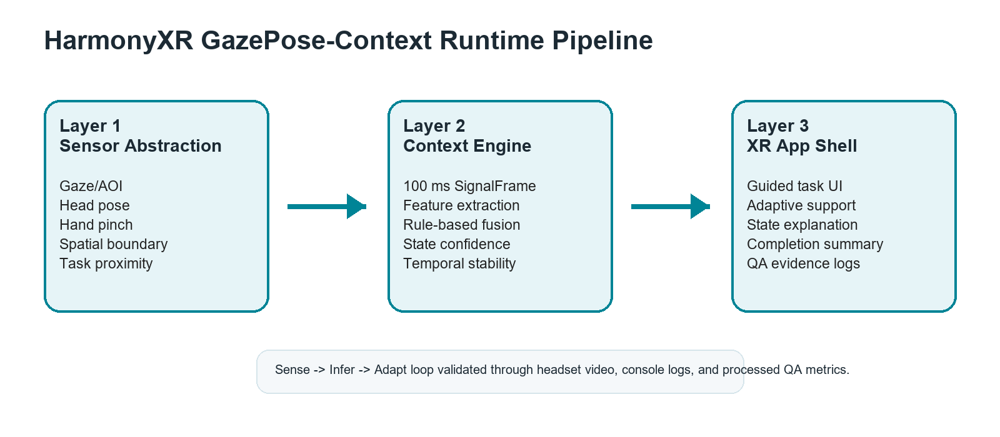
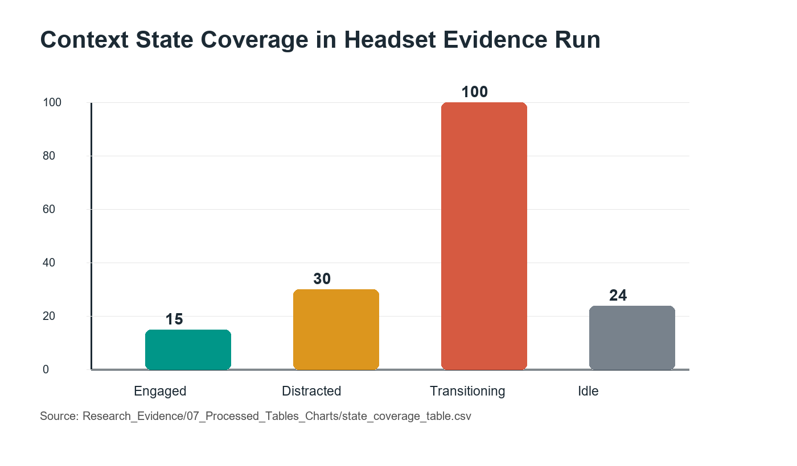

# Abstract

Adaptive extended reality (XR) systems require more than object interaction; they require an ability to understand whether a user is focused, distracted, transitioning between steps, or inactive. This paper presents HarmonyXR GazePose-Context, a Unity and Meta Quest proof-of-concept that infers user context during a guided XR sorting task using runtime signals available in the current headset-facing implementation. The system uses a three-layer architecture: sensor abstraction, context inference, and XR app shell adaptation. Runtime evidence was collected from a Quest headset run using Unity console logs, filtered QA evidence, processed CSV tables, and a headset video. The evidence run produced 169 QA metric samples and captured all four target context states: Engaged, Distracted, Transitioning, and Idle. The results support the feasibility of a lightweight, interpretable adaptive XR prototype that uses multimodal context signals to drive user-facing guidance. The work is positioned as headset-running prototype evidence; a formal participant study remains future Phase 4 work.

**Keywords:** extended reality, adaptive XR, context inference, gaze, hand tracking, posture, multimodal interaction, Unity, Meta Quest

# 1. Introduction

XR training systems increasingly need to support users who shift between focused task execution, attention loss, transitional movement, and inactivity. Traditional XR applications often respond only to explicit controller input or predefined task events. This limits the system's ability to provide timely help when the user is distracted, paused, or moving between task steps.

HarmonyXR GazePose-Context addresses this problem through a lightweight multimodal context inference prototype. The system observes runtime signals from the XR scene, combines them into a shared signal frame, infers one of four user context states, and exposes adaptive support in the XR app shell. The user task is intentionally simple: sort virtual objects into matching targets. This keeps the research focus on context inference and adaptive response rather than game complexity.

The main contribution of this work is not a new game mechanic or a full user study. It is a working headset-facing proof-of-concept that demonstrates how multimodal XR runtime signals can support context-aware behavior during a controlled training task.

The contributions are:

1. A three-layer implementation structure for adaptive XR context inference.
2. A headset-facing prototype that captures gaze/AOI evidence, spatial context, hand interaction, pinch state, and gaze timing features available in the current runtime.
3. A four-state context model covering Engaged, Distracted, Transitioning, and Idle behavior.
4. A user-facing adaptive XR shell that communicates context state and task guidance.
5. A runtime evidence package containing a headset video, console logs, filtered state evidence, and processed tables.

# 2. Related Work

The paper is positioned across five areas of XR research: gaze and attention in immersive environments, multimodal attention detection, body and hand tracking, multimodal XR interaction, and context-aware XR adaptation.

## 2.1 Gaze Tracking and Attention in VR

Eye tracking is widely used in VR to estimate attention, object focus, dwell behavior, and gaze-based interaction. Moreno-Arjonilla et al. survey VR eye-tracking hardware, calibration, gaze estimation methods, datasets, and application areas, showing that gaze is a foundational signal for immersive interaction and attention analysis [1]. However, the survey also makes clear that gaze-centric systems do not by themselves capture full user context, because they typically do not integrate body pose, task events, or broader behavioral signals.

Pastel et al. compare gaze accuracy and precision between real-world and VR conditions [2]. Their results show that gaze can be useful in controlled static tasks, but accuracy and precision become more difficult under dynamic conditions. This supports the design decision in HarmonyXR GazePose-Context to avoid relying on gaze/AOI evidence alone and instead combine it with hand, posture, spatial, and task-related signals.

## 2.2 Multimodal Attention and XR Interaction

Long et al. demonstrate that multimodal physiological sensing can improve classification of internal and external attention in VR by combining EEG and eye-tracking features [3]. This supports the broader claim that multimodal sensing can improve attention-state inference. At the same time, their approach depends on specialized EEG hardware and uses time windows that are larger than the lightweight runtime loop used in the current prototype. HarmonyXR therefore focuses on behavioral and interaction signals that can be collected inside an XR application without adding brain-computer-interface hardware.

Rakkolainen et al. provide a scoping review of multimodal interaction technologies in extended reality, covering gaze, gestures, speech, haptics, physiological sensing, and other modalities [4]. Kim et al. later analyze the chronological shift from controller-based interaction toward hand, gaze, wrist, voice, and multimodal input across XR device generations [5]. Together, these reviews show that XR interaction is moving toward multimodal input, but they also highlight a gap between collecting multiple input channels and using those channels for real-time behavioral context inference.

## 2.3 Body, Head, and Hand Tracking

Body and posture signals provide useful evidence about user behavior beyond visual attention. Bustamante et al. show that skeleton-based posture recognition can classify standing, sitting, and lying using lightweight geometric heuristics [6]. Neidhardt et al. show that head-mounted XR tracking can provide useful evidence about body movement during VR-based musculoskeletal training [7]. These works support the use of posture and movement signals, but they focus mainly on physical-state estimation rather than combining pose with gaze/AOI and task-state evidence for adaptive XR behavior.

Hand interaction is another important behavioral signal in XR because it indicates whether the user is actively manipulating or approaching task objects. Lei et al. propose a sensor-fusion approach for precise hand tracking in VR using multiple sensing sources and temporal modeling [8]. Their work focuses on improving hand-tracking accuracy, while HarmonyXR uses hand and pinch evidence as part of a higher-level context inference model.

## 2.4 Gaze-Based Feedback and Context-Aware Adaptation

Selaskowski et al. present gaze-based attention refocusing training in VR for adults with ADHD [9]. Their system uses gaze behavior to trigger feedback when attention shifts away from a continuous performance task, while also collecting EEG, head movement, and performance measures for analysis. This work is relevant because it shows how gaze behavior can drive real-time feedback, but its online decision logic remains primarily gaze-based rather than a fused multimodal context model.

Davari and Bowman propose a design space for context-aware XR interfaces and evaluate an adaptive placement strategy for XR content [10]. Their work demonstrates the importance of context-aware adaptation for usability and cognitive load, but the context reasoning is primarily about interface placement and environmental relevance. Ramiotis and Mania propose CONTEXT-GAD, a context-aware adaptive dwell model that combines gaze behavior, head rotation, interaction frequency, and scene context to adapt gaze dwell thresholds [11]. This shows that recent XR research is moving from gaze-only interaction toward context-aware adaptation, but the adaptation remains centered on gaze selection rather than general user-context inference.

## 2.5 Research Gap

Existing XR research shows strong progress in gaze tracking, multimodal sensing, body/posture recognition, hand tracking, and context-aware interface adaptation. However, these strands are often treated separately: gaze systems focus on attention or selection, posture systems focus on body-state classification, hand-tracking systems focus on tracking accuracy, and context-aware XR systems often adapt placement or feedback based on narrow context definitions. HarmonyXR GazePose-Context addresses this gap at prototype level by combining runtime gaze/AOI evidence, hand interaction, posture or spatial context, and task-related signals into an interpretable four-state context model that drives adaptive XR support.

# 3. Research Problem and Scope

The research problem is: how can an XR system infer user context from lightweight runtime signals and use that inference to support adaptive behavior during a training task?

The current paper focuses on prototype implementation and evidence-based validation. It does not claim a completed participant study or statistical comparison. Phase 4 user study work is treated as future work.

The current scope includes:

- Unity and Meta Quest headset execution.
- TrainingSimulation sorting task.
- Four context states: Engaged, Distracted, Transitioning, Idle.
- Runtime QA metrics and context-state evidence.
- Adaptive support and completion feedback inside the XR experience.

The current scope excludes:

- New gameplay systems.
- Phone/mobile support.
- Formal user study statistics.
- NASA-TLX results.
- Baseline-versus-adaptive participant comparison.

# 4. System Overview

The implementation follows the three-layer structure defined in the implementation guide and WBS: Sensor Abstraction, Context Engine, and XR App Shell. Figure 1 summarizes the runtime pipeline.

## 4.1 Layer 1: Sensor Abstraction

The sensor abstraction layer converts headset and scene signals into runtime fields. Relevant fields include AOI, posture or spatial posture context, boundary mode, fixation duration, dwell ratio, saccade rate, body activity, hand interaction count, pinch state, and distance to task object. These are emitted through QA metrics and logged for validation.

## 4.2 Layer 2: Context Engine

The context engine consumes the synchronized signal frame and infers a context state. The current implementation uses interpretable rule-based logic and confidence values rather than a black-box model. This design keeps the proof-of-concept explainable for research and stakeholder review.

## 4.3 Layer 3: XR App Shell

The XR app shell translates inferred state into visible user support. It includes onboarding, task guidance, context-aware feedback, adaptive support actions, QA/evidence logging, and end-of-session completion messaging.

# 5. Prototype Implementation

The prototype is implemented in Unity 2022.3.62f1 with OpenXR 1.14.3 and Meta XR SDK 201.0.0. The app targets Meta Quest headset execution. The primary scene is TrainingSimulation, where the user sorts a cube, cylinder, and sphere into corresponding pads or receptacles.

The main implementation components are:

- **SignalSynchroniser:** emits runtime signal frames on a 100 ms cadence.
- **ContextDebugTester / context pipeline:** evaluates context state and confidence.
- **TrainingSimulationUserGuide:** presents onboarding, task guidance, incorrect-object messaging, and completion summary.
- **AdaptationManager:** maps inferred context states to adaptive XR support and QA metric console logging.
- **ContextLogger:** records context output for analysis.

The proof-of-concept intentionally stays within a narrow research scope. It does not add unrelated gameplay or study-management systems. The goal is to show that adaptive XR behavior can be driven by inferred context signals during a simple task.

# 6. Context State Model

The system infers four context states.

**Engaged** indicates that the user is focused on task-relevant content or interacting with the current task. It represents active task participation.

**Distracted** indicates that attention has shifted away from the task or that task-directed activity is reduced. It supports refocus guidance.

**Transitioning** indicates movement between task steps, targets, or interaction states. It supports soft guidance while the user changes focus.

**Idle** indicates low activity, little interaction, or a pause state. It supports rest, recentering, or continuation options.

These states are used as runtime categories for adaptive behavior and evidence reporting. They are not clinical or psychological diagnoses.

# 7. Evidence Collection Method

Evidence was collected through a combined headset evidence run on May 14, 2026. ADB logcat captured Unity runtime console output while the application ran in the Quest headset. The collected artifacts were organized under `Research_Evidence`.

Primary evidence files include:

- `03_Context_State_Coverage/20260514_run01_full-evidence.mp4`
- `05_Stability_Latency/20260514_run01_console-evidence.txt`
- `05_Stability_Latency/20260514_run01_filtered-evidence.txt`
- `07_Processed_Tables_Charts/qa_metrics_extract.csv`
- `07_Processed_Tables_Charts/state_coverage_table.csv`
- `07_Processed_Tables_Charts/adaptation_event_table.csv`
- `07_Processed_Tables_Charts/stability_latency_table.csv`

The evidence run produced 169 QA metric samples. Each QA metric line contained state, confidence, boundary, AOI, posture/spatial context, fixation, dwell, saccade, body activity, hand interaction count, pinch state, and distance to task object.

# 8. Results

## 8.1 Context State Coverage

All four required context states appeared in the headset evidence run.

| State | Samples | First timestamp | Last timestamp | Found |
|---|---:|---|---|---|
| Engaged | 15 | 05-14 16:19:18.956 | 05-14 16:21:33.401 | Yes |
| Distracted | 30 | 05-14 16:16:46.104 | 05-14 16:21:55.453 | Yes |
| Transitioning | 100 | 05-14 16:19:28.044 | 05-14 16:21:48.434 | Yes |
| Idle | 24 | 05-14 16:16:49.126 | 05-14 16:22:02.470 | Yes |

## 8.2 Runtime Signal Coverage

The QA metric log confirms that the runtime emitted the key signal fields required for paper evidence.

| Signal field | Status | Evidence source |
|---|---|---|
| AOI | Present in QA_METRICS | Runtime console log and qa_metrics_extract.csv |
| POSTURE | Present in QA_METRICS | Runtime console log and qa_metrics_extract.csv |
| BOUND | Present in QA_METRICS | Runtime console log and qa_metrics_extract.csv |
| FIX | Present in QA_METRICS | Runtime console log and qa_metrics_extract.csv |
| DWELL | Present in QA_METRICS | Runtime console log and qa_metrics_extract.csv |
| SACC | Present in QA_METRICS | Runtime console log and qa_metrics_extract.csv |
| BODY | Present in QA_METRICS | Runtime console log and qa_metrics_extract.csv |
| HAND | Present in QA_METRICS | Runtime console log and qa_metrics_extract.csv |
| PINCH | Present in QA_METRICS | Runtime console log and qa_metrics_extract.csv |
| DIST | Present in QA_METRICS | Runtime console log and qa_metrics_extract.csv |

## 8.3 Adaptive Behavior Evidence

The adaptation evidence table records each trigger state and its expected adaptive response category. Engaged maps to normal task support, Distracted maps to refocus or attention guidance, Transitioning maps to soft movement or task-step support, and Idle maps to pause or adaptive support behavior. The current evidence shows that the trigger states are emitted during headset runtime. Visual confirmation is supported by the full headset evidence video. This evidence should be interpreted as runtime behavior proof, not as a controlled measurement of user benefit.

## 8.4 Stability Evidence

The run captured QA metric output from 05-14 16:16:46.104 through 05-14 16:22:02.470. No crash was indicated in the captured evidence, and the QA metric stream continued during the run. The available evidence therefore supports runtime continuity during the captured session. A more detailed latency analysis with explicit measured values should be added before making a strong real-time performance claim.

# 9. Discussion

The evidence supports the central claim that a headset-running XR prototype can infer and expose user context using lightweight multimodal runtime signals. The presence of all four context states demonstrates that the model is reachable across the expected behavioral conditions. This does not by itself prove classification accuracy, because no participant ground truth or independent annotation is included in the current evidence package. The signal coverage table demonstrates that the runtime records enough evidence to support analysis of gaze/AOI, posture or spatial posture context, hand interaction, pinch state, and gaze-derived timing features.

The communication improvements in the app shell are also important. Earlier versions of the prototype risked appearing like a technical debug demo. The current presentation better explains the research purpose, active task, inferred state, and adaptive support. This matters because the proof-of-concept is intended for first-time users, clients, and research stakeholders, not only developers.

# 10. Limitations

This work remains a prototype-level validation rather than a completed user study. The evidence comes from a headset evidence run, not from a multi-participant controlled experiment. The results should therefore be interpreted as proof-of-concept validation, not as statistical evidence that adaptive XR improves task performance or workload.

Several implementation boundaries should be noted. The current paper uses gaze/AOI evidence as recorded by the runtime and does not claim a completed participant-calibrated eye-tracking accuracy study. The `room_scale` posture value should be interpreted as spatial or boundary context, not strict sitting/standing recognition. Sitting or standing should only be discussed where explicit sitting or standing values appear in the logs. The current context log format is JSONL-style runtime evidence rather than a single JSON array document. Some guide-level QA requirements, such as formal participant self-report ground truth and baseline/adaptive comparisons, remain Phase 4 work.

# 11. Future Work

Future Phase 4 work should conduct a formal within-subjects study comparing baseline and adaptive conditions. The planned study should collect task completion time, sorting errors, context detection accuracy against ground truth, and subjective workload. Additional future work may include richer locomotion modeling, face tracking, EEG or physiological signals, multi-user context modeling, and personalization of inference thresholds.

# 12. Conclusion

HarmonyXR GazePose-Context demonstrates a working adaptive XR proof-of-concept that infers user context from runtime signals and uses that context to support task guidance. The headset evidence package confirms all four target states and 169 QA metric samples containing key signal fields. While formal Phase 4 participant evaluation remains future work, the current implementation provides a credible systems prototype and evidence base for an adaptive XR research paper.

# Acknowledgment and Disclosure

This draft was prepared from the current OpenSpatialAI implementation, HarmonyXR planning documents, and the May 14, 2026 evidence package. AI-assisted development and documentation tools were used during project work; final submission should include the disclosure wording required by the target venue.

# References

[1] J. Moreno-Arjonilla, A. Lopez-Ruiz, J. R. Jimenez-Perez, J. E. Callejas-Aguilera, and J. M. Jurado, "Eye-tracking on virtual reality: a survey," *Virtual Reality*, vol. 28, article 38, 2024, doi: 10.1007/s10055-023-00903-y.

[2] S. Pastel, C.-H. Chen, L. Martin, M. Naujoks, K. Petri, and K. Witte, "Comparison of gaze accuracy and precision in real-world and virtual reality," *Virtual Reality*, vol. 25, pp. 175-189, 2021, doi: 10.1007/s10055-020-00449-3.

[3] X. Long, S. Mayer, and F. Chiossi, "Multimodal Detection of External and Internal Attention in Virtual Reality using EEG and Eye Tracking Features," in *Proceedings of Mensch und Computer 2024 (MuC '24)*, 2024, doi: 10.1145/3670653.3670657.

[4] I. Rakkolainen, A. Farooq, J. Kangas, J. Hakulinen, J. Rantala, M. Turunen, and R. Raisamo, "Technologies for multimodal interaction in extended reality: a scoping review," *Multimodal Technologies and Interaction*, vol. 5, no. 12, article 81, 2021, doi: 10.3390/mti5120081.

[5] H. Kim, S. Lee, and C. Kang, "From controllers to multimodal input: a chronological review of XR interaction across device generations," *Sensors*, vol. 26, no. 1, article 196, 2026, doi: 10.3390/s26010196.

[6] A. Bustamante, L. M. Belmonte, A. Pereira, R. Morales, and A. Fernandez-Caballero, "Skeleton-based posture recognition for home care from virtual unmanned aerial vehicle," *Expert Systems*, 2025, doi: 10.1111/exsy.70108.

[7] M. Neidhardt, S. Gerlach, F. N. Schmidt, I. A. K. Fiedler, S. Grube, B. Busse, and A. Schlaefer, "VR-based body tracking to stimulate musculoskeletal training," arXiv:2308.03375, 2023.

[8] Y. Lei, Y. Deng, L. Dong, X. Li, X. Li, and Z. Su, "A novel sensor fusion approach for precise hand tracking in virtual reality-based human-computer interaction," *Biomimetics*, vol. 8, no. 3, article 326, 2023, doi: 10.3390/biomimetics8030326.

[9] B. Selaskowski et al., "Gaze-based attention refocusing training in virtual reality for adult attention-deficit/hyperactivity disorder," *BMC Psychiatry*, vol. 23, article 74, 2023, doi: 10.1186/s12888-023-04551-z.

[10] S. Davari and D. A. Bowman, "Towards context-aware adaptation in extended reality: a design space for XR interfaces and an adaptive placement strategy," arXiv:2411.02607, 2024, doi: 10.48550/arXiv.2411.02607.

[11] G. Ramiotis and K. Mania, "CONTEXT-GAD: a context-aware gaze adaptive dwell model for gaze-based selections in XR environments," in *Proceedings of the 31st ACM Symposium on Virtual Reality Software and Technology (VRST '25)*, 2025, doi: 10.1145/3756884.3766048.
